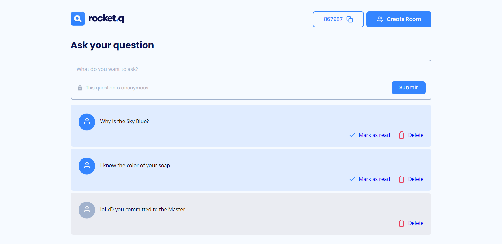

<h1 align="center">NLW TOGETHER MISSION: DISCOVER</h1>
<h3 align="center">ROCKETSEAT NLW TOGETHER MISSION: DISCOVER FILES</h3>

 

    

 

#### TECHNOLOGIES:
- HTML 📄
- CSS 🎨
- JavaScript 💻
- NodeJS 🐱‍👤
- EJS 📜
- Express 🔗
- SQLite 📦

 

#### HOW TO USE:
* First have NodeJS on your machine
* With the project folder already open in VS CODE (or similar) type the commands in the sequence: "npm install", "npm run init-db" and "npm start"
* then open the domain "localhost:5000"
* finally, have fun and use Rocket.Q when you need it!

 

<h5 align="center">Felipe Macci</h5>